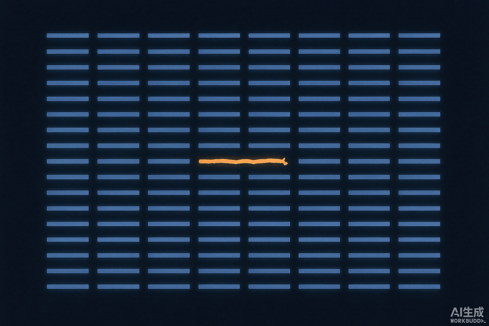

+++
title = '人味儿，正在变成一种 bug'
description = '跟 AI 说话说久了，我发现自己在人群里越来越像个异类。'
date = 2026-08-29T15:50:00+08:00
draft = false
slug = 'human-bug'
tags = ['AI', '表达']
categories = ['数字生活', '杂文']
+++

## 我说话越来越像它了

现在给 AI 提需求，我已经形成肌肉记忆了：背景、目标、约束、输出格式，四件套，缺一不可。不这么写，它给你的东西就飘。

用久了，这套格式开始往回渗。

上周跟同事说个事，打完一段话我停在那儿，脑子里自动过了一遍：我的结论是什么？论据分几层？要不要先铺个背景？最后我把它删了，重发了一版"结构化"的。

更吓人的是另一次——跟朋友吐槽一件破事，噼里啪啦打完，我盯着屏幕愣了三秒。逻辑不闭环，删了重写。

那三秒我有点后背发凉：我在跟朋友吐槽，又不是在写需求文档。

## 规整是很贵的

AI 说的话有个共同点：正确、完整、没毛病、没脾气。你挑不出错，但也记不住任何一句。

因为"没毛病"的代价是"没毛边"。一段话里没有废话，也就没有那个多余的情绪。

可人和人之间，撑住关系的往往就是那些废话。"我今天真的烦死了"——这句话没有任何信息量，但它有用。它的意思是：我现在需要你。

我现在发朋友圈会犹豫。想发"今天真累"，打完又觉得太矫情、太空、没内容，好像非得写点"有价值的东西"才配发出去。

连吐槽都要有信息增量了。

## 轮到人味儿突兀了

前几天看到有人发了一大段话，没重点、带情绪、前后还有点矛盾。我第一反应是：这人想说什么，重点呢？

然后我反应过来——那才是人啊。

我们花了很大力气教 AI 说话像人：要自然、要共情、要像朋友一样聊天。这个目标眼看着就要实现了。

但没人说过，这个改造是双向的。我们训练它的同时，它也在格式化我们。

结果是：AI 说话越来越像人，人说话越来越像 AI。而且我们这一边，是自愿的。

## 最后

我还是要说人话。

哪怕它不闭环，哪怕它有毛边，哪怕它在这个越来越整齐的世界里，显得有点突兀。

突兀就突兀吧。AI 不会突兀——因为它不需要被理解。
