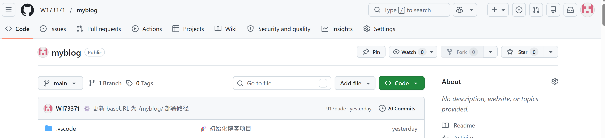
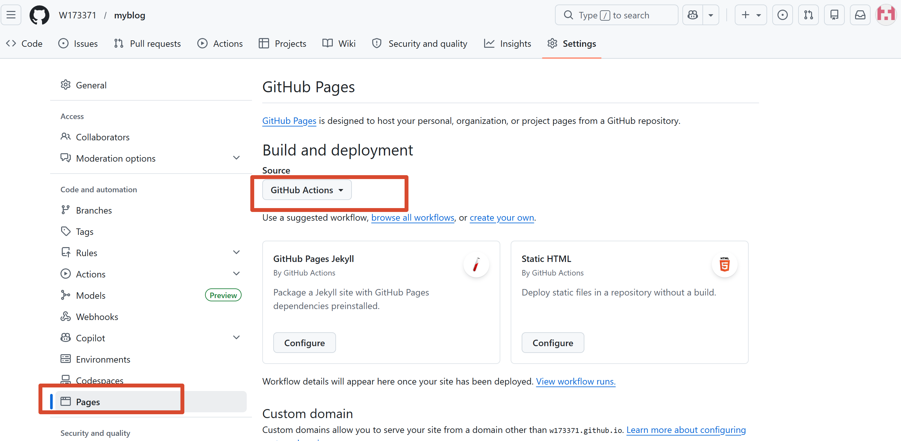

+++
title = "从0到1搭建个人博客"
description = ""
date = "2026-05-12T13:27:49+08:00"
preview = ""
draft = false
tags = [ ]
categories = [ "数字生活" ]
+++

# 为什么搭博客

一是想重拾表达习惯，二是想全过程使用ai指导，亲自看下ai目前的能力。因为我是文科生，没有编程基础，在以前的印象里，建站是一个需要编程基础的活。  

# 建博客全过程
先是deepseek，了解一下建站的过程。大概分为1构建静态网站2托管平台3部署这么一个链条。
搭建完成以后的流程是，本地写文章，推送到github，托管平台自动部署，网站自动更新。
- 为什么选hugo？  
  随便选的，ds推荐了几个路线，hugo是需要动手的，为了练手，选择了hugo 。  

- 主题选择  
  一开始用的papermod，后来觉得支持的功能太少，不够美观，又换成了Fixlt。  

##

## 静态网站托管
静态网站托管，就是存储构建的网页文件的地方。  
1.腾讯云cloudbase  
优点：全程可视化，界面简单。  

缺点：免费开发环境只能部署，不能增加域名。个人版19.9/月。  

部署过程中也是遇到了hugo版本问题，给codebuddy好一阵折腾。自家人何苦为难自家人嘞哈哈哈。  
最终：放弃  

2.github pages  
2.1 确认仓库状态
我的仓库是 W173371/myblog，已经是 Public，代码也推上去了。
2.2启用 GitHub Pages
    打开 https://github.com/W173371/myblog
    点顶部 Settings

左侧菜单点 Pages
Source 选 GitHub Actions

2.3创建部署文件  
在 VS Code 里，在你的博客项目 myblog 下新建这个文件： github/workflows/hugo.yaml  
粘贴以下内容：
```bash
name: Deploy Hugo site to Pages

on:
  push:
    branches:
      - main

jobs:
  build-deploy:
    runs-on: ubuntu-latest
    steps:
      - uses: actions/checkout@v4
        with:
          submodules: true

      - name: Setup Hugo
        uses: peaceiris/actions-hugo@v3
        with:
          hugo-version: '0.161.1'
          extended: true

      - name: Build
        run: hugo --minify

      - name: Deploy
        uses: peaceiris/actions-gh-pages@v3
        with:
          github_token: ${{ secrets.GITHUB_TOKEN }}
          publish_dir: ./public
```
2.4推送到 GitHub    
注意：是在项目的目录下执行命令  

```bash
git add -A
git commit -m "添加 GitHub Pages 自动部署"
git push
```
2.5 查看网址
等 2-3 分钟，去 Settings → Pages 页面，顶部会出现你的网址：


## 买域名、绑定域名

我在腾讯云买的个人域名。在腾讯和阿里买就行了。  
购买域名之前，需要先进行一个实名。实名会有审核时间，几个小时就审核通过了。  
购买域名以后，注册局也会审核一下域名。  


## 日常运维
## 优化记录
在初步配置成功后，对自带的主题进行优化调整，同时也看到一些优秀的自建博客，参考学习。
### 主题中加图片图标

### 中文显示
系统自带的某些字段为英文，显示为中文  
打开 hugo.toml，在 [params] 里加一行:  
    dateFormat = "2006-01-02"

    **我就正常写**

