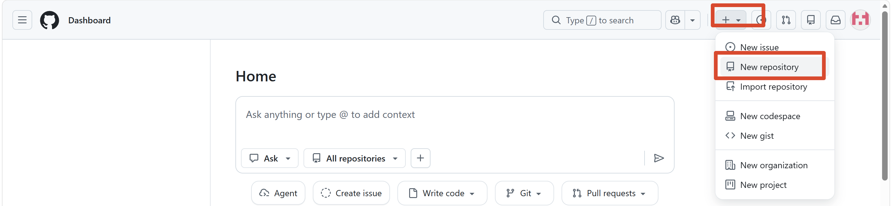
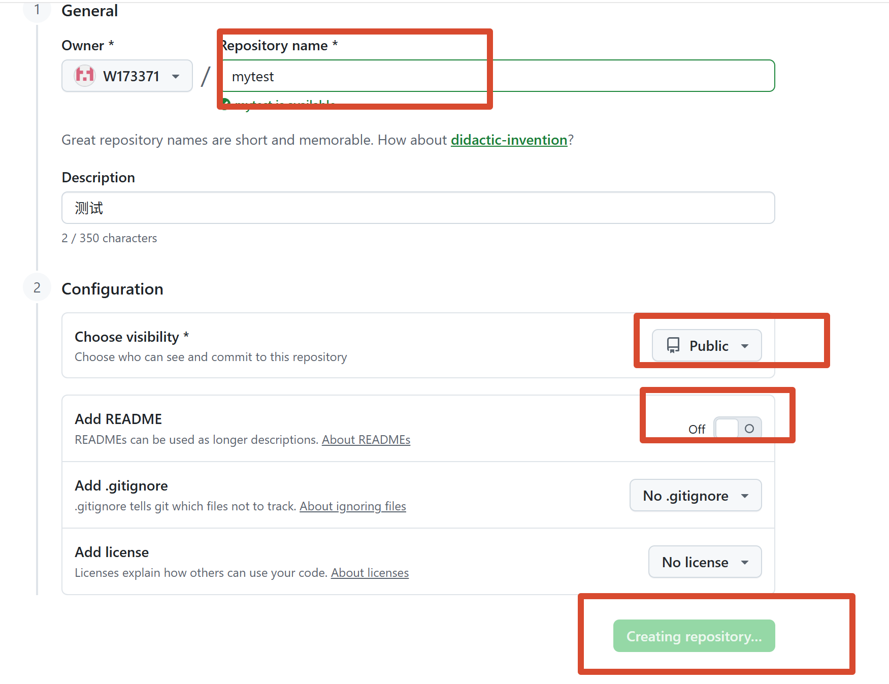

+++
title = '关于代码版本管理'
description = ""
date = '2026-05-22T11:21:54+08:00'
draft = false
tags = [ ]
categories = [ "数字生活" ]
+++
  
 测试一下，推送完以后，有没有自动部署。 
#  为什么会有这个想法

因为我不懂代码，所有功能都是先有想法，然后交由AI生成代码，我来负责测试功能是否实现，并将结果告知AI，再进行调整。      
如此往复过程中，遇到了一个问题：AI在解决了原有问题，增加新功能过程中，会导致原功能也被搞乱了。   
所以迫切需要代码版本的管理。  
这样，可以不断迭代更新，不至于影响原有功能。  
本文记录关于个人代码版本管理的一些尝试。    

#  什么是版本管理？
一句话定义：用工具记录代码文件的每一次历史变更，让你能随时回到任何一个历史状态，并支持多人协作。  
游戏存档类比：  
本地仓库 = 你电脑上的游戏进度

暂存区 = 选好了要保存的文件，但还没确认存档

提交 = 真正创建一个存档点（如“打败Boss前”）

远程仓库 = 云存档（防丢失、可协作）
---------以上是DS总结--------
个人理解：在没有开启版本管理时，本地代码都是实时的，就像眼睛一样，。  
开启了版本管理以后，就像快照一样，可以进行存档了。  
git是本地的存档，存档的版本可以放云上上，也就是github这类工具的作用。

#  Git 与 GitHub 的区别

Git ：	  
性质：一个工具（命令行/软件）  
作用：在本地电脑上管理代码版本  
联网：不需要（提交、查看历史都在本地）  

GitHub：  
性质：一个平台（网站/云服务）  
作用：在云端托管代码仓库，实现协作  
联网：需要（上传、下载、协作需联网）  
其他类似 GitHub 的平台：GitLab、Gitee（码云）、Bitbucket、Azure DevOps。

一句话总结：Git 是“引擎”，GitHub 是“云服务器”。  

先在本地建立git，然后和Github连通，以后就可以向云端推送代码。

#  实操 本地代码备份到云端（GitHub/Gitee）
1.注册平台github  

访问 github.com，点击 Sign up，填写用户名、邮箱、密码  
验证邮箱（去邮箱里点确认链接）  

2.创建仓库，生成仓库地址  
登录 GitHub，点击右上角 + → New repository

填写仓库名（比如 mytest）
不要勾选 "Add a README file"（因为本地是空的，勾选会产生冲突）

点击 Create repository

GitHub：https://github.com/你的用户名/你的项目名.git    

3.本地推到云端  
回到你的本地项目文件夹，打开终端。  
3.1  如果是第一次，需要先初始化git，再进行提交。  
```bash
# 1. 进入项目文件夹
cd /你的项目路径

# 2. 初始化 Git  只需要1次
git init

# 3. 添加所有文件
git add .

如果需要单独加某一个文件

# 4. 第一次提交
git commit -m "第一次提交"

# 5. 添加远程仓库地址
git remote add origin https://gitee.com/你的用户名/my-project.git

# 6. 推送到远程
git push -u origin main

```  
3.2 如果已经有了git，日常推送
```bash
git add -A

git commit -m "本次推送的备注"

git push
```  
有时候网络不好，需要多push几次。

# 使用了代码管理以后的工作流
日常使用vscode进行编辑
git add .
git commit -m "修改说明"
git push
三步走齐活。

# 使用 VScode、 CodeBuddy、、Trae进行代码版本管理  
三个软件自带git管理，直接使用软件自带的编辑器即可。
## vscode
待补充
## CodeBuddy
待补充
## Trae
待补充


# Git 的基础操作 

```bash
git init  # 初始化 Git 仓库
```  

```bash
git commit -m "提交说明"   # 创建存档  
```  

```bash
git log --oneline         # # 查看所有存档的ID和说明
```  

```bash
git status  # 查看文件修改状态
```

```bash
git add . # 把所有改动加入“暂存区”（相当于选中要存档的文件） 
```
 `.` 表示所有文件。也可以单独添加某个文件：`git add index.html`
```bash
git add index.html  # 添加 index.html加入“暂存区”
```    

```bash
git commit -m "第一次提交"  #提交代码（创建存档）-m后面是存档说明

```

```bash
git clone https://github.com/用户名/仓库名.git  #从 GitHub 下载别人的项目（克隆）会把整个项目下载到当前文件夹。
```   

```bash
git reset --hard 存档ID  # 回到指定的存档（慎用，会丢弃之后所有改动）
```

```bash
git push -u origin main   # 第一次推送，把你的代码上传到远程的main分支
git pull origin main      # 拉取最新代码到本地（每天开始工作前先做这一步）
```

#  分支管理
分支可以让你同时开发多个功能而不互相干扰。这就像游戏里的不同“时间线”。  

main 分支：线上稳定运行的版本，禁止直接在上面修改。  

dev 分支：开发主分支，用于集成大家最新的代码。  

feature/xxx 分支：每个新功能单独一个分支。  

分支管理功能，待到下一个大型项目上线时，再来补充。

#  注意事项 

每天开始工作前，先 git pull：否则第二天你可能会陷入痛苦的“合并冲突”。

提交信息要清晰：“修复问题” 是无效的，要写 “修复了在Safari浏览器上点击登录无响应的问题”。

不要提交敏感信息：密码、API密钥、数据库地址等，绝对不能提交到Git仓库。请使用 .gitignore 文件忽略它们（比如 config.json）。
## 安装 Git

### 1.确认 Git 是否已安装

- **Mac**：按 `Cmd+空格`，输入 `terminal`，回车
- **Windows**：按 `Win+R`，输入 `cmd`，回车
- **VS Code/CodeBuddy/Trae**：按 `` Ctrl+` `` 打开内置终端

输入以下命令：

```bash
git --version
```

**如果显示版本号**（如 `git version 2.39.5`）：✅ 已安装，跳到第二步。

**如果显示 `command not found`**：❌ 需要安装。  

### 2.安装git
- **Mac**：终端执行 `xcode-select --install`
- **Windows**：去 [git-scm.com](https://git-scm.com) 下载安装包，一路下一步
- **Linux**：`sudo apt install git`（Ubuntu/Debian）或 `sudo yum install git`（CentOS）

安装完再执行 `git --version` 确认。

---
